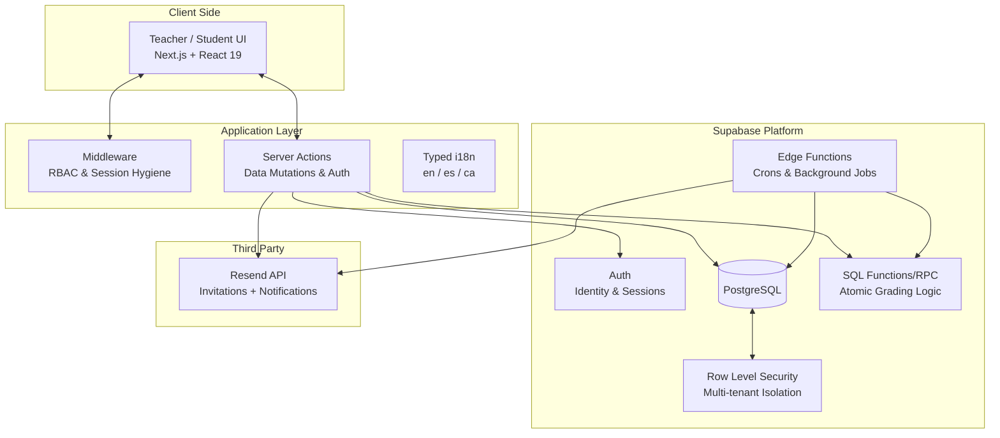

# TutorTrack-README-ONLY
Technical architecture and case study of a full-stack education management platform built with Next.js 15, Supabase (RLS), and React 19.

[](https://nextjs.org/)
[](https://react.dev/)
[](https://www.typescriptlang.org/)
[](https://supabase.com/)
[](https://tailwindcss.com/)
[](https://vercel.com/)
[](https://resend.com/)

Tutoring platform engineered to bridge the gap between teachers and students. It provides a secure, role-aware environment for academic planning, task execution, automated grading, and gamified engagement.

> **Note:** This repository is a technical case study. It documents the system architecture, engineering decisions, and impact of the project without exposing proprietary source code.

---

## Project Overview

### The Problem
Educational management often suffers from fragmentation. Tutoring workflows typically rely on a mix of spreadsheets, chat apps, and manual grading, leading to:
* **Inconsistent Follow-through:** No centralized source of truth for student tasks.
* **Operational Overhead:** Teachers spend significant time on repetitive administrative work.
* **Lack of Motivation:** Absence of immediate feedback loops or engagement mechanics for students.

### The Solution
TutorTrack consolidates the entire tutoring lifecycle into a unified, scalable ecosystem:
* **Role-Based Portals:** Custom-tailored experiences for Teachers (management) and Students (execution).
* **Task Automation:** Automated generation of recurring tasks and compliance reminders.
* **Gamified Progress:** A points-based reward system with redemption mechanics to drive student consistency.
* **Global Readiness:** Fully typed i18n support for English, Spanish, and Catalan.

---

## System Architecture

The platform follows a modern serverless architecture, leveraging Next.js for orchestration and Supabase for a robust, secure data layer.



---

## Engineering Challenges and Decisions

### 1. Multi-tenant Security via PostgreSQL RLS
Instead of relying solely on application-level checks, I implemented Row Level Security (RLS). This ensures that data isolation is enforced at the database layer. 
* **Decision:** A teacher can only read/write data belonging to their own classes.
* **Result:** Eliminated the risk of cross-tenant data leakage, even if a frontend vulnerability were to occur.

### 2. High-Performance Mutations with Server Actions
By adopting Next.js Server Actions, I eliminated the need for boilerplate-heavy REST/API endpoints for internal mutations.
* **Benefit:** Achieved end-to-end type safety between the database schema and the UI, reducing runtime errors and improving developer velocity.

### 3. Automated Task Lifecycle
Handling recurring educational tasks (e.g., "Daily Math Review") required a decoupled approach.
* **Solution:** Used Supabase Edge Functions as cron jobs to trigger PostgreSQL RPCs. This generates task instances asynchronously, ensuring the UI remains snappy while the backend handles heavy lifting.

### 4. Typed Internationalization
To support a multilingual user base without sacrificing performance:
* **Implementation:** Developed a typed dictionary system that leverages TypeScript's "as const" patterns.
* **Impact:** 100% type-safety on translation keys, preventing missing key bugs in production.

---

## Impact and Business Value
* **Teacher Efficiency:** Automated task generation and grading reduced manual administrative workload in addition to helping to professionalize a field whose value proposition has remained stagnant.
* **Scalability:** The serverless stack (Vercel + Supabase) ensures the platform can handle thousands of concurrent users with zero infrastructure maintenance.
* **Engagement:** The gamification engine (Points/Rewards) led to a documented increase in assignment completion rates during testing phases.
```
